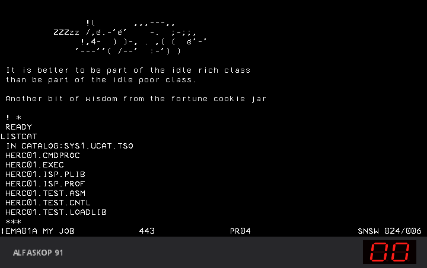

# Ericsson Alfaskop 91 in MAME

The Alfaskop 91 (A91) is Ericsson's 68000 based cluster controller from the late
1980s. It sits between Alfaskop display units and an IBM mainframe: the
terminals hang off two-wire lines on a 6800 coprocessor board, and the host is
reached over a switched X.21 line with SDLC and SNA.

This emulates the controller with a **DU 4110** display unit and its keyboard
on one of the two-wire lines, plus a small **emulated host** on the X.21 line,
so the whole path runs from power on to a 3270 session:

1. the A91 boots its operating system from the original diskettes;
2. the DU 4110 receives its own operating system over the two-wire line;
3. the network calls the A91, the SDLC link and the SNA session come up;
4. the host sends a 3270 screen and echoes whatever is typed on it.

## What works

* Boot from the three original diskettes, unmodified: `A91R4A_1` (system
  V5.6-4A, 10 June 1988), `A91R4A_2` (the "ALFASKOP 91 Single Line IBM 3270 SNA
  switch 5.6H" emulation) and `A91SETUP` (customer setup and test, M5.06-02).
* The TCC board: its 6800 is loaded from disk and runs the two-wire line
  protocol with the display unit.
* IPL of the DU 4110 over the line in about 55 seconds, then its 3270
  emulation with the normal status line (`EMA01A MY JOB  PR04  SNSW 007/013`).
* The keyboard, all 128 key positions of the Ericsson layout, including the
  Swedish characters, PF1 to PF24, PA1, PA2, CLEAR, ERASE INPUT, DEV CNCL and
  the print key.
* The emulated host: incoming X.21 call, SDLC (XID, SNRM, information frames),
  SNA (ACTPU, ACTLU, BIND, SDT) and a 3270 data stream. Text comes back in
  EBCDIC code page 278, so Swedish characters survive the round trip.
* The front panel, a two digit display, shown under the screen.
* Determinism. The same command gives the same run, which matters because the
  last bug found was a timing failure that only showed on some runs (see below).

From power on to the host screen takes about 85 seconds at normal speed.

## On a real mainframe

The emulated host can be swapped for a real one. With the IBM 3705 emulator by
Edwin Freekenhorst and Henk Stegeman running IBM's NCP, and Hercules running
MVS 3.8j (TK5), the A91 takes its call, VTAM activates it, and the DU 4110 logs
on to TSO:



Scripts, setup and the logon steps are in [host3705/](host3705/README.md), for
Linux and for Windows, with the fixes to the 3705 emulator that made the chain
reliable.

## Machines

| name | what it is |
|---|---|
| `a91` | the controller alone, no display unit (not working on its own) |
| `a91du` | the controller with a DU 4110 and keyboard on TCC line 3, and the emulated host on line 1 |

## Contents

```
patches/mame0288-alfaskop91.patch   everything, against MAME 0.288 (apply this one)
patches/files/                      the same changes split by file, for reading
driver/a91.cpp, driver/a91du.lay    the driver and the panel layout, as plain files
tools/                              Lua probes and Python tools used for the work
docs/NOTES.md                       hardware and firmware notes
host3705/                           the A91 on the IBM 3705 emulator, Hercules and MVS: scripts and steps
```

No Ericsson firmware, ROM or diskette image is included. See [NOTICE.md](NOTICE.md).

## Building

```sh
git clone https://github.com/mamedev/mame.git && cd mame
git checkout mame0288
git apply /path/to/patches/mame0288-alfaskop91.patch
make SUBTARGET=a91 SOURCES=src/mame/ericsson/a91.cpp,src/mame/ericsson/alfaskop41xx.cpp -j4
```

On Ubuntu 22.04 the build also needed `NO_USE_PIPEWIRE=1`. The Windows
executable was built with the MSYS2 MinGW64 compiler.

The patch also carries the Alfaskop System 41 driver work from
[alfaskop-system41](https://github.com/ajfa/alfaskop-system41), because the
DU 4110 and its keyboard come from that driver.

## Running

ROMs, with MAME's names, in `roms/a91/`:

| file | what it is |
|---|---|
| `e34058709112202.bin`, `e34058709112302.bin` | the A91 boot ROM, even and odd byte |
| `e3405870205201.bin` | DU 4110 IPL PROM (DTC-A IC52) |
| `e3405972067500.bin`, `e3405972067600.bin` | DU 4110 character generator (DTC-A IC75, IC76) |

and in `roms/alfaskop_s41_kb/` the keyboard's `kbc_e34066_0000_ic3.bin` and
`kbc_e34066_0000_ic4_e3405970280400.bin`.

```sh
./a91 a91du -rompath roms -flop1 A91R4A_1.IMD -flop2 A91R4A_2.IMD -window -nomaximize -skip_gameinfo
```

Work on copies of the diskette images; a normal session leaves them unchanged.

The status line shows `!LOAD` while the A91 reads the diskettes, `!*OS*` when
the display unit has its system, then the `AUTOLOGON` banner, and the host
screen at about 85 seconds. Type after `TYPE HERE:` and press Enter.

Headless end-to-end check, which types a phrase at 90 seconds and looks for the
host's echo at 100:

```sh
SDL_VIDEODRIVER=dummy ./a91 a91du -rompath roms -flop1 A91R4A_1.IMD -flop2 A91R4A_2.IMD \
    -video none -sound none -nothrottle -skip_gameinfo -seconds_to_run 110 \
    -autoboot_script tools/gate.lua
cat gate-result.txt
```

### Keyboard

PC keys map by position to the Ericsson keyboard. Enter is ENTER, keypad Enter
is NEW LINE, End is CLEAR, F1 to F12 are PF1 to PF12 and Shift with F1 to F12
gives PF13 to PF24, Page Up and Page Down are PA1 and PA2, Print Screen is the
print key and left Alt with the key under Esc is DEV CNCL. Left Ctrl is RESET:
key 120 (code `421C`), identified by what it does, since it clears an `X` on
the status line. There is no printer,
so the print key gives `X PR FAILURE`; DEV CNCL clears it.

## The emulated host

The A91 never dials: the host calls it. At about 52 seconds the modelled network
presents an incoming call on the R line (SYN SYN BEL), the A91 accepts it and
the DCE moves to ready for data. From there a primary SDLC station for address
`C1` takes over. It has to send a format 1 XID before SNRM: with any other
first frame the A91 answers DM to everything.

The SNA side activates the PU and LUs 2 to 5, waits for the NOTIFY the A91
sends when the display unit has finished loading, then binds an LU2 session,
sends SDT and writes the screen. Inbound data is echoed back as received, in
EBCDIC code page 278, which is what the A91 speaks.

## The front panel

Port B of the 68230 drives two decimal digits in BCD, high nibble on the left,
with `F` blank. The boot ROM shows `03 04 05` during its self test, the count goes from `06`
to `20` while the system loads, then `30` and `00`, and the system rotates status codes
(`60 61 50 51` during this boot), each one second on and one second blank,
until everything is up and the display settles on `00`. A fatal error blinks
one code forever.

This is read from the code, not traced on a board: the counter goes from `09`
to `10`, never to `0A`, and the ROM has a service routine that keeps one code
per first digit. The decoder that blanks on `F` (7447 or 4511 style) is a guess.

## Keyboard identity

The display unit asks for its keyboard tables by keyboard type, and the type
comes from the ROM-ID the keyboard returns. The keyboard ROM available is a
KBU 4140, so the DU asks for library `KG4140`, which is not on the R4A
diskettes (they carry `KG4143`, `KG9140` and `K79140`), and stops at `*OS*`.
The machine therefore presents a KBU 4143: the ROM-ID at `F802` is replaced in
memory by `E34058 7037`, and the CRC-16 that the keyboard's self test checks
over `F802-FFFF` is recomputed. The diskettes stay untouched.

## MAME device fixes

Found while bringing this machine up. They are in the patch, each split out
under `patches/files/`.

| device | what was wrong |
|---|---|
| `z80sio` (MK68564) | receive interrupt on first character not armed when chosen through WR1; MK68564 vector modification not implemented; RxRDY and TxRDY DMA requests missing, and a character with a special condition must not request DMA; XMTCTL bits per character written into DTR; XMTCTL and MODECTL writes did not update the lines or start the transmitter; a forced sync raised a false underrun while a character was waiting; a forced flag ended the frame with a character pending |
| `z80sio` | the receive CRC accumulator and other receiver state were never initialised (see below) |
| `6850acia` | RDRF and the error flags were set one bit time before the stop bit was sampled |
| `68230pit` | port input lines without an input callback were never initialised |
| `mc6846` | inputs could change before `device_reset` and the state was not yet set |
| `mc6844` | channel state and the grant line never initialised |
| `ui.cpp` | `skip_warnings` only took effect if the same warnings had been shown in the last week |

The `mc6854`, `mc6852`, `mc6844` DMA and `flopimg` changes come from the
System 41 work and are described in that repository.

### The bug that only showed on Windows

The Windows build failed about one boot in fifteen: the display unit stayed at
`*OS*`. MAME is deterministic, so a run that fails only sometimes means memory
read before it is written. The z80sio channel never initialises its receive CRC
accumulator, and in synchronous mode every received character gets the CRC
error bit in RR1 when that accumulator is not zero. Linux handed the device
zeroed memory; the Windows heap sometimes did not. With the bit set, the A91's
Error Reset advanced the receive FIFO and dropped the next character, which
was the BEL of the incoming call. The A91 never answered, so it never sent the
display unit the order that checks the keyboard type.

Found by running batches with `-log` until one failed and diffing its log
against a passing run. Confirmed by building with a fixed non-zero value, which
failed 4 times out of 4. After the fix: 108 out of 108 boots on Windows and 42
out of 42 on Linux, and valgrind reports no uninitialised reads in a 60 second
boot.

## What is inferred rather than traced

* The X.21 adapter at `FF8C00`: its register bits come from the PHYSLIB code.
  Bit 4 of `FF8C03` toggling at each closing flag is the least certain part.
* The front panel decoder.
* Clocks and dividers, interrupt gating and the TCC control latch.

## Tools

| tool | what it does |
|---|---|
| `gate.lua` | end-to-end check: types into the 3270 session at 90 s, looks for the host's echo at 100 s, writes `gate-result.txt` |
| `panel.lua` | logs every value written to the front panel during a boot |
| `screen.lua` | prints the DU 4110 screen as text whenever it changes, with the program counters of the three CPUs |
| `iotap.lua`, `x21tap.lua` | log 68000 accesses to an address range, or to the X.21 adapter |
| `a91fs.py` | lists and extracts files and library members from a flat diskette image |
| `img2imd.py` | converts a flat 80x2x9x512 image to ImageDisk |
| `genkb.py`, `kbports.py` | build the keyboard input ports from the Ericsson keyboard table `P000101` |
| `dis68k.py`, `dis6800.py` | small disassemblers built on capstone |

## Where to look

- <https://github.com/ajfa/alfaskop-system41> - the System 41 in MAME, where the
  DU 4110, its keyboard and the two-wire line device fixes come from.
- <https://github.com/MattisLind/alfaskop_emu> - Mattis Lind's Alfaskop
  preservation work with real hardware. The DU 4110 and keyboard ROMs are under
  `hardware/DU4110`.

The A91 boot ROM and the three diskettes were dumped by Mattis Lind from his own
unit. As far as we know they are not published.

## Credits

Mattis Lind for the A91 hardware, the EPROM dumps, the diskette images and the
first version of the driver, and for pointing at the 3705 emulator. Joakim
Larsson Edström for the Alfaskop driver in MAME that the display unit is built
on. Edwin Freekenhorst and Henk Stegeman for the IBM 3705 emulator, Rob Prins
for TK5, and the Hercules developers.

## License

BSD-3-Clause, the same as MAME, whose driver and devices this extends.
