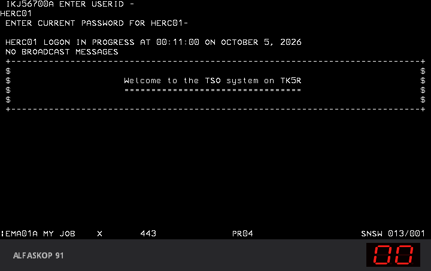

# The Alfaskop 91 on a real NCP, VTAM and TSO

The emulated host in the driver is a stand-in: it speaks just enough SNA to
bring up one 3270 session and echo it. This directory replaces it with the real
thing. The A91's host line is bridged to a line of the **IBM 3705 emulator**
by Edwin Freekenhorst and Henk Stegeman, which runs IBM's own NCP and is
channel-attached to **Hercules**, which runs **MVS 3.8j** with VTAM and TSO
from **TK5**. The display unit logs on to TSO and runs commands.

```
DU 4110 -- two-wire line -- Alfaskop 91 (MAME a91du)
                                  |  SDLC frames over TCP
                            IBM 3705 emulator, NCP N16A, line 020
                                  |  channel 660 over TCP
                            Hercules 4.6, MVS 3.8j TK5: VTAM, TSO
```


## What happens

1. MVS comes up and VTAM loads the sample NCP `N16A` into the 3705 (about
   two minutes).
2. The A91 boots. At about 52 seconds the modelled X.21 network calls it, and
   the bridge sends the format 1 XID that the A91 waits for.
3. `run.sh` activates line `L16A20`, PU `P16A20A` and LU `T16A20A1`. The NCP
   sends SNRM, VTAM sends ACTPU and ACTLU, and the VTAM logon screen comes up
   on the DU 4110, with `EMA01A SYS OP` on the status line.
4. From there it is TSO, with the steps below.



## What you need

* Linux on x86-64. This was tested on Ubuntu 22.04 under WSL2. The 3705
  emulator is Linux software.
* `git gcc make libncurses-dev libbsd-dev autoconf automake libtool cmake
  flex gawk m4 zlib1g-dev libbz2-dev unzip python3`.
* The `a91` MAME binary built from this repository, the ROMs and the two
  diskettes `A91R4A_1.IMD` and `A91R4A_2.IMD` (see the main README).
* `mvs-tk5.zip`, TK5 Update 5, from <https://www.prince-webdesign.nl/>. The
  one tested here has SHA-256
  `710d002843631322810a276dd42c793fda458548dc64d86e2914a62db7425f84`.

## Setting it up

Everything is built and unpacked under `work/` next to the scripts, unless
`WORK` says otherwise.

```sh
./prepare.sh /path/to/mvs-tk5.zip
```

This builds the 3705 emulator from <https://github.com/snhstq/IBM3705_R5>
(commit `73994e8`) and Hercules from
<https://github.com/SDL-Hercules-390/hyperion> (tag `Release_4.6`) with the
`comm3705.c` that comes with the 3705 emulator. Then it unpacks TK5, copies
the NCP volume `ncpssp.3350` into it at 244, comments out TK5's simulated 3705s
at 660 to 66B and puts the emulated one at 660. It takes about ten minutes.

```sh
./setup-tk5.sh
```

This starts MVS without a window and makes the one-time changes by submitting
jobs to it. It takes about fifteen minutes. Run it once, on a fresh TK5.

| change | why |
|---|---|
| catalog the seven NCP data sets on `NCPSSP` | as in the 3705 emulator's README |
| `SYS1.SSPLIB` added to `LNKLST00`, `NCPSSP` to `VATLST00` | the same |
| TK5's `IFLOADRN` removed from `SYS1.LINKLIB` | it only loads TK5's simulated 3705s; the real loader is in `SYS1.SSPLIB` |
| `N07` to `N15` out of `ATCCON01` | they are the NCPs of the simulated 3705s, which are gone |
| `N08R` and `N10R` to `N15R` out of `SYS1.VTAMLIB`, then a compress | without this the NCP link-edit ran out of space (SD37) |
| NCP generation of `N16A`, stage 1 and 2 | as in the 3705 emulator's README; the stage 2 deck comes back through the card punch and its link into `SYS1.VTAMLIB` gets `DISP=SHR` |
| `N16A`: PU `P16A20A` gets `SSCPFM=USSSCS`, `MODETAB=BSPLMT02`, `DLOGMOD=MHP3278E` | the A91 talks to the SSCP in characters, not in 3270 data stream; `MHP3278E` is the logon mode that got through to TSO |

The members it changes are saved first as `LNKLSTBK`, `VATLSTBK` and
`ATCCONBK`. At the end it loads the NCP once to check it.

## Running it

```sh
A91_MAME=/path/to/a91 A91_ROMPATH=/path/to/roms A91_DISKS=/path/to/diskettes ./run.sh
```

The A91 opens in a window after the NCP is loaded. Log on like this:

| on the screen | press |
|---|---|
| the VTAM logon screen, `SYS OP` on the status line | type `LOGON APPLID(TSO) LOGMODE(MHP3278E)`, Enter |
| `MY JOB` and `X 443` on the status line, nothing else | Left Ctrl (RESET), then F3 (PF3) |
| `IKJ56700A ENTER USERID -` | `HERC01`, Enter |
| `ENTER CURRENT PASSWORD FOR HERC01-` | `CUL8TR`, Enter |
| the welcome banner and `***` | Enter |
| the fortune cookie and `***` | Page Up (PA1) |
| `READY` | any TSO command, for example `LISTCAT`; `LOGOFF` to leave |

Why the two odd steps:

* Right after the BIND, TSO asks the terminal what it can do (a Write
  Structured Field, Read Partition Query). The DU 4110 accepts it and does not
  answer, and its keyboard stays locked with `X 443`. RESET unlocks it, and PF3
  makes TSO carry on to the logon prompts.
* TK5 starts its ISPF menu for HERC01 at the end of the logon. The menu is
  in colour, and the DU 4110 rejects colour orders: the status line shows
  `X 470` and TSO keeps repainting `IKT00405I SCREEN ERASURE CAUSED BY ERROR
  RECOVERY PROCEDURE`. PA1 at the fortune cookie interrupts the logon CLIST
  before the menu starts and leaves TSO at `READY`.

When MAME closes, `run.sh` stops MVS and the 3705. With `KEEP=1` it leaves
them running.

### Without a window

```sh
LUA=tso-logon.lua A91_MAME=... A91_ROMPATH=... A91_DISKS=... ./run.sh 330
```

`tso-logon.lua` does the steps above by itself and runs `LISTCAT`. The screens
go to `work/run/a91/tso.txt`, which ends with `TSO OK`. Two snapshots, at the
welcome banner and after `LISTCAT`, go to `work/run/a91/a91du/`, plus the one
MAME takes itself when the run time is up.

The MVS console log is `work/run/herc.log` and the 3705's is
`work/run/i3705.log`. A console command can be sent while it runs with
`echo "/d net,act" > work/run/herc.in`.

## The bridge

`a91du` gets a bitbanger, `host3705`. With `-bitb socket.<address>:37520` the
driver hands the SDLC frames to the 3705 emulator instead of its own host
model. The 3705 emulator carries frames on its line sockets as `7E`, address,
control, data, `47 0F 7E`, with no bit stuffing and a fixed FCS, and the bridge
does the same. A frame whose data happens to contain `47 0F 7E` would be cut
there; it has not been seen.

The X.21 call stays modelled in the driver, as does one more thing: the A91
answers DM to everything until it has seen a format 1 XID, and an NCP on a
leased line never sends one. So the bridge sends that XID, waits for the A91's
reply and from then on passes every frame through.

The 3705 emulator binds its line sockets to the address of `eth0`, not to
localhost. `run.sh` reads that address from the 3705's log.

## Rough edges

* The DU 4110 has no colour or extended attributes. Any full-screen
  application that uses them fails the same way the ISPF menu does.
* The A91 is set up for Swedish EBCDIC, code page 278, and TK5 writes in
  code page 037, so a few bytes show as other characters than on a US 3270.
  The sides of the TSO welcome banner are byte `5A`, `!` in code page 037,
  and the DU 4110 shows `$`.
* At the logon screen VTAM shows `UNSUPPORTED FUNCTION` twice. That is VTAM
  L2 refusing the NOTIFY the A91 sends when the display unit is ready. It is
  harmless.
* `TIME` answers only `READY`. The trace shows that MVS sends nothing else,
  so it is not the A91.
* A session that hangs can leave `TSO0001` behind and block the next logons.
  `run.sh` IPLs MVS every time, which clears it.
* `run.sh` activates the line 57 seconds after starting MAME, because the
  A91 has to answer the call first. On a machine that cannot run the A91 at
  full speed, give it more time with `ACT_DELAY`.
* The whole chain was only run on Linux.

## Files

| file | what it is |
|---|---|
| `prepare.sh` | builds the 3705 emulator and Hercules, unpacks and configures TK5 |
| `setup-tk5.sh` | the one-time MVS changes, through the card reader and punch |
| `run.sh` | starts the 3705 and MVS, loads the NCP, runs the A91 and activates its line |
| `common.sh` | locations and helpers used by the three above |
| `tk5jobs.py` | builds the setup, NCP stage 2 and `N16A` jobs from members punched out of MVS |
| `jcl/ncpgen1.jcl` | NCP stage 1 for `N16A` |
| `tso-logon.lua` | logs on to TSO and runs `LISTCAT` without a window |
